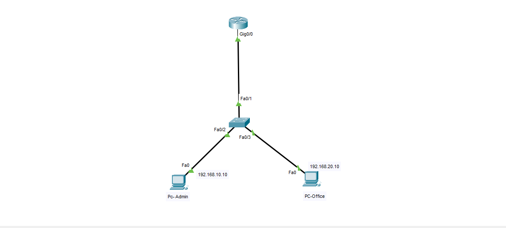

# Netzwerksicherheit – ACL + Port-Security + SSH (Packet Tracer)

Ein kleines, praxisnahes Lab zur **Segmentierung und Härtung** eines LANs in Packet Tracer.

## Ziel
- Zwei VLANs: **Admin (VLAN 10)** und **Office (VLAN 20)**
- **Router-on-a-Stick** (Inter‑VLAN‑Routing) auf dem Router
- **SSH** nur aus VLAN *Admin* erlaubt (VTY mit Access-Class)
- **ACL** auf VLAN *Office*: nur **ICMP → Admin** erlaubt; andere Verbindungen blockiert + log
- **Port‑Security** auf Access‑Ports (sticky MAC, maximum 1, violation restrict)

> Geräte (Empfehlung Packet Tracer): Router **2911**, Switch **2960**, 2× PC

---

## Topologie
```
PC-Admin ---- Fa0/2   VLAN 10    \
                                   \        G0/0.10  192.168.10.1/24
            S1 2960 ---- Fa0/1 --- R1 2911 - G0/0
PC-Office --- Fa0/3   VLAN 20    /         G0/0.20  192.168.20.1/24
```

---

## Adressplan
- **VLAN 10 (Admin):** 192.168.10.0/24 – Gateway 192.168.10.1 (PC: 192.168.10.10)
- **VLAN 20 (Office):** 192.168.20.0/24 – Gateway 192.168.20.1 (PC: 192.168.20.10)

---

## Schritte (Kurzfassung)
1. Geräte in Packet Tracer platzieren und verbinden:
   - R1 **G0/0** ↔ S1 **Fa0/1** (Trunk zum Router)
   - PC‑Admin ↔ S1 **Fa0/2** (Access VLAN10)
   - PC‑Office ↔ S1 **Fa0/3** (Access VLAN20)
2. Konfigurationen unten in die Geräte‑CLI einfügen.
3. IP‑Adressen auf den PCs wie im Adressplan setzen.
4. Tests durchführen.

---

## Konfigurationen

### Router R1
```plaintext
hostname R1
no ip domain-lookup
username admin privilege 15 secret cisco123
ip domain-name lab.local
crypto key generate rsa
ip ssh version 2

interface GigabitEthernet0/0
 no shutdown
!
interface GigabitEthernet0/0.10
 encapsulation dot1Q 10
 ip address 192.168.10.1 255.255.255.0
 description Admin VLAN
!
interface GigabitEthernet0/0.20
 encapsulation dot1Q 20
 ip address 192.168.20.1 255.255.255.0
 description Office VLAN
 ip access-group OFFICE_TO_ADMIN in
!
ip access-list extended OFFICE_TO_ADMIN
 remark Allow ICMP only from Office to Admin
 permit icmp 192.168.20.0 0.0.0.255 192.168.10.0 0.0.0.255
 deny ip 192.168.20.0 0.0.0.255 192.168.10.0 0.0.0.255 log
 permit ip any any
!
ip access-list standard ADMIN_SSH
 permit 192.168.10.0 0.0.0.255
!
line vty 0 4
 login local
 transport input ssh
 access-class ADMIN_SSH in
```

### Switch S1
```plaintext
hostname S1
vlan 10
 name Admin
vlan 20
 name Office
!
interface FastEthernet0/1
 description TRUNK to R1
 switchport mode trunk
 switchport trunk allowed vlan 10,20
 no shutdown
!
interface FastEthernet0/2
 description Admin-PC
 switchport mode access
 switchport access vlan 10
 spanning-tree portfast
 switchport port-security
 switchport port-security maximum 1
 switchport port-security violation restrict
 switchport port-security mac-address sticky
 no shutdown
!
interface FastEthernet0/3
 description Office-PC
 switchport mode access
 switchport access vlan 20
 spanning-tree portfast
 switchport port-security
 switchport port-security maximum 1
 switchport port-security violation restrict
 switchport port-security mac-address sticky
 no shutdown
```

---

## PC‑Einstellungen

**PC‑Admin**
- IP Address: `192.168.10.10`
- Subnet Mask: `255.255.255.0`
- Default Gateway: `192.168.10.1`

**PC‑Office**
- IP Address: `192.168.20.10`
- Subnet Mask: `255.255.255.0`
- Default Gateway: `192.168.20.1`

---

## Tests
- **Ping** von *Office* → *Admin* erlaubt (ICMP ok)
- **SSH** von *Office* → R1 **blockiert**
- **SSH** von *Admin* → R1 **erfolgreich**  
  Auf PC‑Admin:
  ```plaintext
  ssh -l admin 192.168.10.1
  Password: cisco123
  ```
- **Port‑Security** aktiv: beim Umstecken des Office‑PCs auf einen anderen Port → `show port-security` zeigt **restrict**/**sticky**.

---

## 🧰 Fehler & Lösung (eigene Erfahrung)
Während der Konfiguration trat ein kleiner Fehler auf:  
Nach dem Einrichten von Benutzer und VTY‑Linien war **SSH zunächst deaktiviert**.  
Der Router meldete:
```plaintext
%Please create RSA keys (of at least 768 bits size) to enable SSH v2.
```

Ursache: Es war **noch kein RSA‑Schlüsselpaar** erzeugt.  
**Lösung:**
```plaintext
conf t
ip domain-name lab.local
crypto key generate rsa
```
Der Router fragt daraufhin nach der Schlüssellänge → **1024** eingeben.  
Anschließend:
```plaintext
ip ssh version 2
end
show ip ssh    ← sollte „SSH Enabled - version 2.0“ anzeigen
```
Danach funktionierte der Login von PC‑Admin per SSH ohne Probleme.

---

## Fazit
Kleines, aber realistisches Lab: VLAN‑Trennung, gezielte Freigaben per ACL, abgesicherter SSH‑Zugang  
und Port‑Security – ideal zum Üben und für die Ausbildungsbewerbung.
